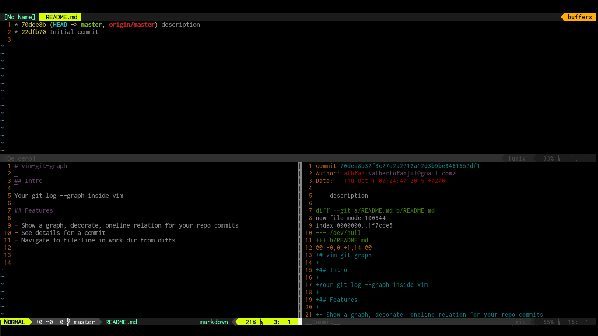

# vim-git-graph

## Intro

Your git log --graph inside vim

## Features

- Show a graph, decorate, oneline relation for your repo commits
- See details for a commit
- Navigate to file:line in work dir from diffs

## Dependencies

This plugin depends on another fork [albfan/AnsiEsc.vim](https://github.com/albfan/AnsiEsc.vim)

## Install

Using [Vundle](https://github.com/VundleVim/Vundle.vim)

Add this lines to `~/.vimrc`

    Plugin 'albfan/vim-git-graph'
    Plugin 'albfan/AnsiEsc.vim'

Update plugins:

    :PluginInstall

